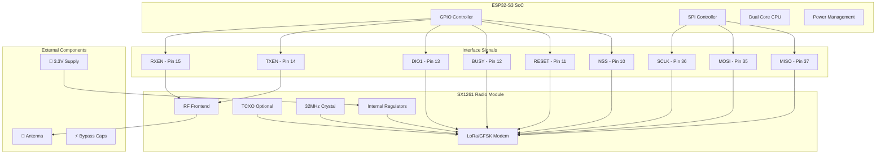
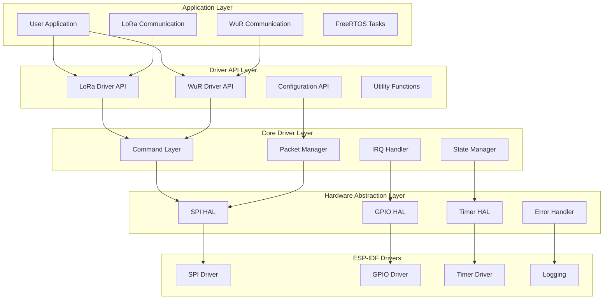
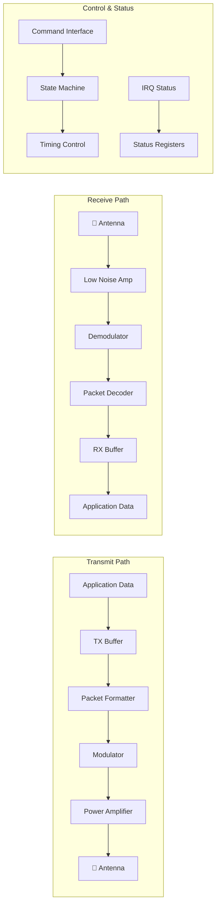
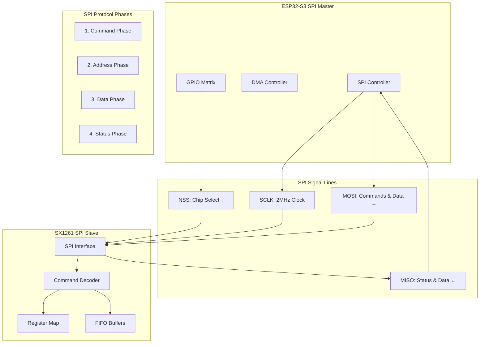
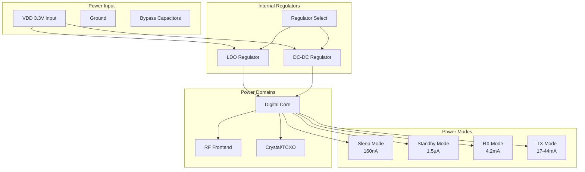
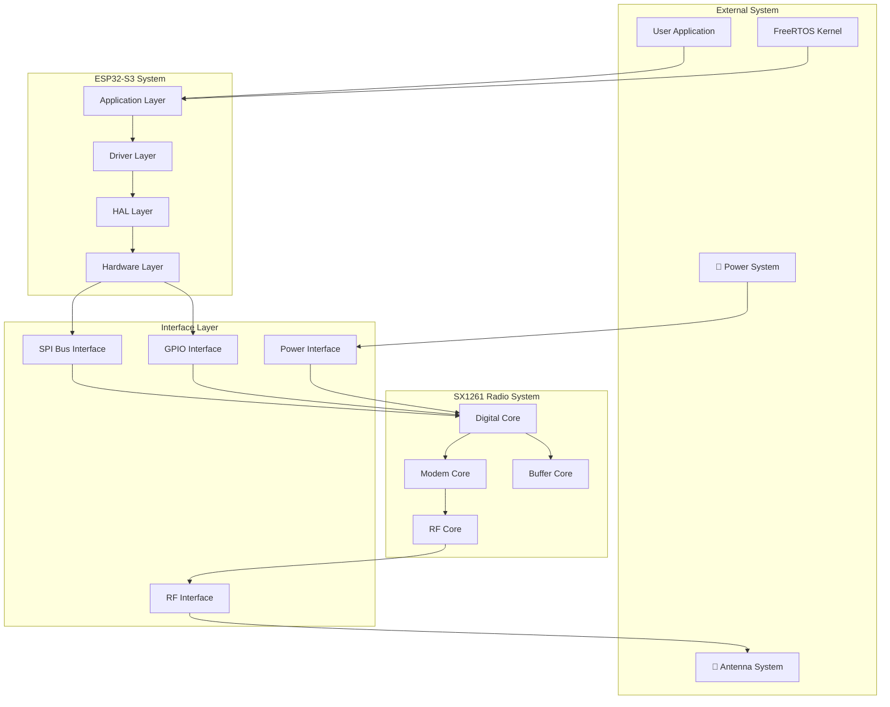
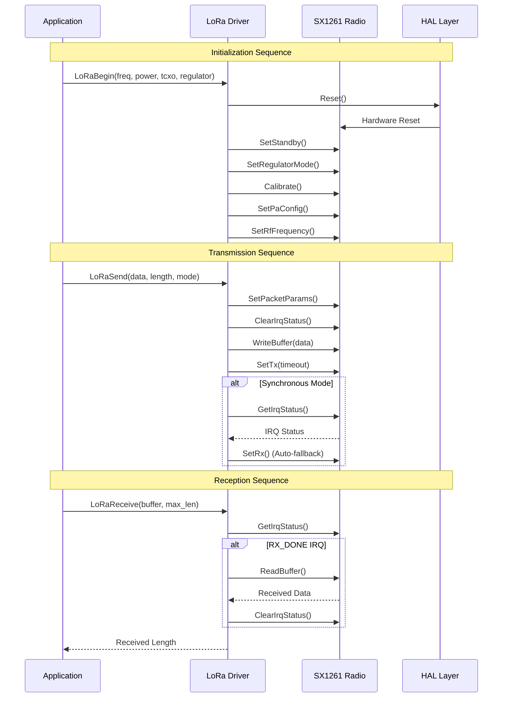
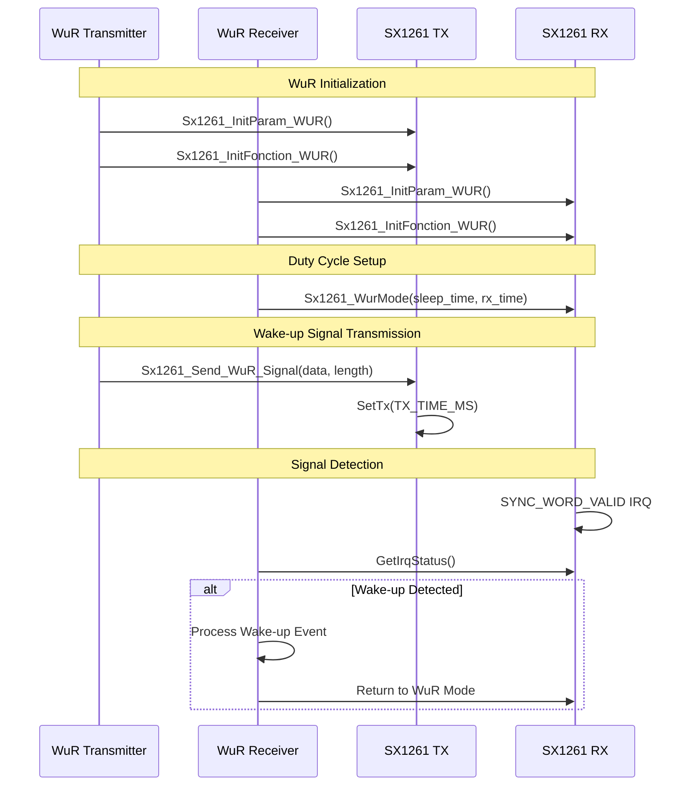
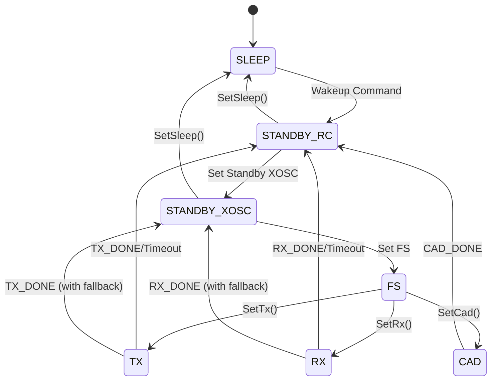
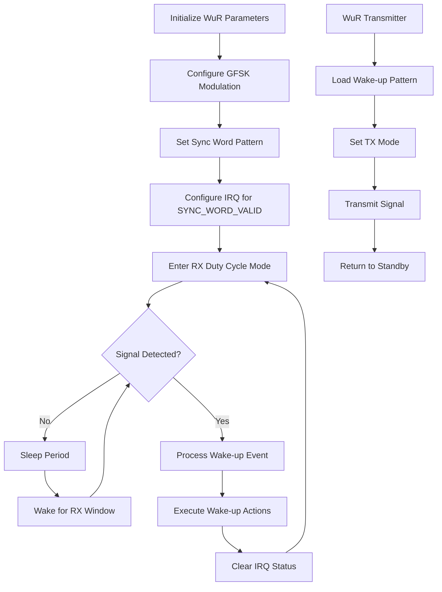

# SX1261 LoRa Radio Driver Documentation

## 📋 Project Overview

This project implements a comprehensive driver for the SX1261 LoRa radio transceiver on ESP32-S3 using ESP-IDF 5.3.1. The driver provides both traditional LoRa communication and Wake-up Radio (WuR) functionality using GFSK modulation for ultra-low power applications.

### Key Features

- **Full SX1261 Radio Control**: Complete implementation of SX126x command set
- **LoRa Communication**: Traditional LoRa packet transmission and reception
- **Wake-up Radio (WuR)**: Ultra-low power wake-up signal detection using GFSK
- **ESP32-S3 Optimized**: Hardware abstraction layer for ESP32-S3 SPI interface
- **Power Management**: Support for both LDO and DC-DC regulator modes
- **TCXO Support**: Configurable temperature-compensated crystal oscillator control
- **Flexible GPIO Control**: Configurable TX/RX enable pins and interrupt handling

---

## 🔧 Hardware Requirements

### ESP32-S3 Pin Configuration

| Signal | GPIO Pin | Description | Required |
|--------|----------|-------------|----------|
| **SPI Signals** | | | |
| MISO | `PIN_SPI_MISO` | SPI Master In Slave Out | ✅ |
| MOSI | `PIN_SPI_MOSI` | SPI Master Out Slave In | ✅ |
| SCLK | `PIN_SPI_SCLK` | SPI Clock | ✅ |
| **Radio Control** | | | |
| NSS | `CONFIG_NSS_GPIO` | SPI Chip Select (Active Low) | ✅ |
| RESET | `CONFIG_RST_GPIO` | Radio Reset (Active Low) | ✅ |
| BUSY | `CONFIG_BUSY_GPIO` | Radio Busy Status | ✅ |
| DIO1 | `CONFIG_DIO1_GPIO` | Digital I/O 1 (Interrupts) | ✅ |
| **RF Switching** | | | |
| TXEN | `CONFIG_TXEN_GPIO` | TX Enable Control | ⚠️ Optional |
| RXEN | `CONFIG_RXEN_GPIO` | RX Enable Control | ⚠️ Optional |

### SX1261 Radio Module Specifications

- **Frequency Range**: 150 MHz to 960 MHz
- **LoRa Data Rate**: 0.018 to 62.5 kbps
- **GFSK Data Rate**: 0.6 to 300 kbps
- **Output Power**: -17 to +14 dBm
- **Sensitivity**: Down to -148 dBm (LoRa SF12, 125 kHz)
- **Power Consumption**: 
  - RX: 4.2 mA
  - TX 14dBm: 44 mA
  - Sleep: 160 nA

---

## 🏗️ System Architecture

### Hardware Block Diagram



### Software Architecture Block Diagram



### Data Flow Block Diagram



### SPI Communication Block Diagram



### Power Management Block Diagram



### Complete System Integration Block Diagram



### Driver Layers

#### 1. **Application Interface Layer**
- `LoRaBegin()` - Initialize radio
- `LoRaSend()` - Send LoRa packets
- `LoRaReceive()` - Receive LoRa packets
- `send_WUR()` - Send wake-up signals
- `Listen_WUR()` - Listen for wake-up signals

#### 2. **Command Abstraction Layer**
- High-level radio configuration functions
- Packet handling and buffer management
- IRQ status management
- Power and frequency control

#### 3. **SX126x Protocol Layer**
- Direct SX126x command implementation
- Register access functions
- Low-level packet operations
- Hardware abstraction interface

#### 4. **Hardware Abstraction Layer (HAL)**
- SPI communication interface
- GPIO control and status reading
- Timing and delay functions
- Platform-specific implementations

---

## 📡 Communication Protocols

### LoRa Communication Flow



### Wake-up Radio (WuR) Communication



---

## 🔄 System State Machines

### Radio State Machine



### WuR Operation Flow



---

## 📚 API Reference

### Core Initialization Functions

#### `LoRaBegin()`
```c
int16_t LoRaBegin(uint32_t frequencyInHz, int8_t txPowerInDbm, 
                  float tcxoVoltage, bool useRegulatorLDO)
```
**Purpose**: Initialize the LoRa radio with specified parameters.

**Parameters**:
- `frequencyInHz`: Operating frequency (150MHz - 960MHz)
- `txPowerInDbm`: TX power (-17 to +14 dBm)
- `tcxoVoltage`: TCXO voltage (0.0 to disable, 1.6V - 3.3V)
- `useRegulatorLDO`: `true` for LDO, `false` for DC-DC regulator

**Returns**: `ERR_NONE` on success, error code on failure

**Example**:
```c
// Initialize at 868 MHz, 14 dBm, 3.3V TCXO, DC-DC regulator
int16_t result = LoRaBegin(868000000, 14, 3.3, false);
if (result != ERR_NONE) {
    ESP_LOGE(TAG, "LoRa initialization failed: %d", result);
}
```

#### `LoRaConfig()`
```c
void LoRaConfig(uint8_t spreadingFactor, uint8_t bandwidth, uint8_t codingRate, 
                uint16_t preambleLength, uint8_t payloadLen, bool crcOn, bool invertIrq)
```
**Purpose**: Configure LoRa modulation parameters.

**Parameters**:
- `spreadingFactor`: SF7 to SF12 (SX126X_LORA_SF7 - SX126X_LORA_SF12)
- `bandwidth`: 125kHz, 250kHz, 500kHz (SX126X_LORA_BW_125, etc.)
- `codingRate`: CR 4/5 to 4/8 (SX126X_LORA_CR_4_5 - SX126X_LORA_CR_4_8)
- `preambleLength`: Preamble length in symbols (8-65535)
- `payloadLen`: Fixed payload length (0 for variable length)
- `crcOn`: Enable CRC checking
- `invertIrq`: Invert I/Q signals

### Data Transmission Functions

#### `LoRaSend()`
```c
bool LoRaSend(uint8_t *pData, uint8_t len, uint8_t mode)
```
**Purpose**: Send LoRa packet.

**Parameters**:
- `pData`: Pointer to data buffer
- `len`: Data length (1-255 bytes)
- `mode`: `SX126x_TXMODE_SYNC` for blocking, `SX126x_TXMODE_ASYNC` for non-blocking

**Returns**: `true` on success, `false` on failure

#### `LoRaReceive()`
```c
uint8_t LoRaReceive(uint8_t *pData, uint16_t len)
```
**Purpose**: Receive LoRa packet.

**Parameters**:
- `pData`: Buffer for received data
- `len`: Maximum buffer size

**Returns**: Number of bytes received (0 if no packet)

### Wake-up Radio Functions

#### `send_WUR()`
```c
void send_WUR(void)
```
**Purpose**: Initialize and start WuR transmission task.

**Usage**: Call once to start continuous wake-up signal transmission.

#### `Listen_WUR()`
```c
void Listen_WUR(void)
```
**Purpose**: Initialize and start WuR reception mode.

**Usage**: Call once to start listening for wake-up signals.

### Configuration Functions

#### `SetTxPower()`
```c
void SetTxPower(int8_t txPowerInDbm)
```
**Purpose**: Change transmission power.

**Parameters**:
- `txPowerInDbm`: Power level (-17 to +14 dBm)

#### `GetPacketStatus()`
```c
void GetPacketStatus(int8_t *rssiPacket, int8_t *snrPacket)
```
**Purpose**: Get signal quality metrics for last received packet.

**Parameters**:
- `rssiPacket`: Pointer to store RSSI value (dBm)
- `snrPacket`: Pointer to store SNR value (dB)

---

## ⚙️ Configuration Guide

### Menuconfig Settings

Configure your ESP-IDF project with the following settings:

```bash
idf.py menuconfig
```

Navigate to your custom configuration and set:

```
CONFIG_NSS_GPIO=10          # SPI Chip Select
CONFIG_RST_GPIO=11          # Reset pin
CONFIG_BUSY_GPIO=12         # Busy status pin
CONFIG_DIO1_GPIO=13         # Interrupt pin
CONFIG_TXEN_GPIO=14         # TX enable (optional)
CONFIG_RXEN_GPIO=15         # RX enable (optional)
```

### SPI Configuration

The driver uses the following SPI settings:
- **Frequency**: 2 MHz
- **Mode**: 0 (CPOL=0, CPHA=0)
- **Bit Order**: MSB first
- **CS Control**: Software controlled

### Power Management Options

#### LDO vs DC-DC Regulator
```c
// Use LDO regulator (simpler, higher power consumption)
LoRaBegin(868000000, 14, 3.3, true);

// Use DC-DC regulator (more efficient, requires external components)
LoRaBegin(868000000, 14, 3.3, false);
```

#### TCXO Configuration
```c
// No external TCXO
LoRaBegin(868000000, 14, 0.0, false);

// With external TCXO at 3.3V
LoRaBegin(868000000, 14, 3.3, false);
```

---

## 🔨 Build Instructions

### Prerequisites

- ESP-IDF 5.3.1 or later
- ESP32-S3 development board
- SX1261 radio module

### Build Steps

1. **Clone and Setup**:
```bash
git clone https://gitlab.inria.fr/fun-team/lora_wur_v2.git
cd lora_wur_v2
idf.py set-target esp32s3
```

2. **Configure Hardware Pins**:
```bash
idf.py menuconfig
# Navigate to your component configuration
# Set GPIO pins according to your hardware
```

3. **Build Project**:
```bash
idf.py build
```

4. **Flash and Monitor**:
```bash
idf.py flash monitor
```

### Build Flags

Add these to your `CMakeLists.txt` for optimization:

```cmake
# Enable radio debug output
target_compile_definitions(${COMPONENT_LIB} PRIVATE 
    CONFIG_LORA_DEBUG=1
)

# Optimize for size
set_property(TARGET ${COMPONENT_LIB} PROPERTY COMPILE_OPTIONS "-Os")
```

---

## 📖 Usage Examples

### Basic LoRa Communication

#### Transmitter Example
```c
#include "sx1261_driver.h"

void app_main(void) {
    // Initialize LoRa
    int16_t result = LoRaBegin(868000000, 14, 3.3, false);
    if (result != ERR_NONE) {
        ESP_LOGE(TAG, "LoRa init failed: %d", result);
        return;
    }
    
    // Configure LoRa parameters
    LoRaConfig(SX126X_LORA_SF7,        // Spreading Factor 7
               SX126X_LORA_BW_125,     // 125 kHz bandwidth  
               SX126X_LORA_CR_4_5,     // Coding Rate 4/5
               8,                       // Preamble length
               0,                       // Variable length
               true,                    // CRC enabled
               false);                  // Standard IQ

    // Send data
    uint8_t message[] = "Hello LoRa!";
    while (1) {
        bool success = LoRaSend(message, sizeof(message), SX126x_TXMODE_SYNC);
        if (success) {
            ESP_LOGI(TAG, "Message sent successfully");
        }
        vTaskDelay(pdMS_TO_TICKS(5000)); // Send every 5 seconds
    }
}
```

#### Receiver Example
```c
#include "sx1261_driver.h"

void app_main(void) {
    // Initialize with same parameters as transmitter
    LoRaBegin(868000000, 14, 3.3, false);
    LoRaConfig(SX126X_LORA_SF7, SX126X_LORA_BW_125, SX126X_LORA_CR_4_5,
               8, 0, true, false);
    
    // Start receiving
    SetRx(0xFFFFFF); // Continuous RX mode
    
    uint8_t rxBuffer[256];
    while (1) {
        uint8_t rxLen = LoRaReceive(rxBuffer, sizeof(rxBuffer));
        if (rxLen > 0) {
            rxBuffer[rxLen] = '\0'; // Null terminate
            
            // Get signal quality
            int8_t rssi, snr;
            GetPacketStatus(&rssi, &snr);
            
            ESP_LOGI(TAG, "Received: %s (RSSI: %d dBm, SNR: %d dB)", 
                     rxBuffer, rssi, snr);
        }
        vTaskDelay(pdMS_TO_TICKS(100));
    }
}
```

### Wake-up Radio (WuR) Implementation

#### WuR Transmitter
```c
void wur_transmitter_task(void *pvParameters) {
    // Initialize WuR transmitter
    context_t sx_parameters;
    sx1261_init();
    sx126x_reset(&sx_parameters);
    
    Sx1261_InitParam_WUR(&sx_parameters);
    Sx1261_InitFonction_WUR(&sx_parameters);
    
    uint8_t wakeup_signal[10] = {0x7E, 0x7E, 0x7E, 0x7E, 0x7E, 
                                 0x7E, 0x7E, 0x7E, 0x7E, 0x7E};
    
    while (1) {
        ESP_LOGI(TAG, "Sending WuR signal");
        Sx1261_Send_WuR_Signal(&sx_parameters, wakeup_signal, 10);
        
        // Send wake-up signal every 3 seconds
        vTaskDelay(pdMS_TO_TICKS(3000));
    }
}

void app_main(void) {
    xTaskCreate(wur_transmitter_task, "wur_tx", 4096, NULL, 5, NULL);
}
```

#### WuR Receiver
```c
void wur_receiver_task(void *pvParameters) {
    context_t sx_parameters;
    sx1261_init();
    sx126x_reset(&sx_parameters);
    
    Sx1261_InitParam_WUR(&sx_parameters);
    Sx1261_InitFonction_WUR(&sx_parameters);
    
    // Configure duty cycle: 500ms sleep, 500ms receive
    Sx1261_WurMode(&sx_parameters, 500, 500);
    
    sx126x_irq_mask_t irq_status;
    int wake_count = 0;
    
    while (1) {
        sx126x_get_irq_status(&sx_parameters, &irq_status);
        
        if (irq_status & SX126X_IRQ_SYNC_WORD_VALID) {
            wake_count++;
            ESP_LOGI(TAG, "Wake-up signal detected! Count: %d", wake_count);
            
            // Process wake-up event here
            // ... your application logic ...
            
            // Return to WuR mode
            Sx1261_WurMode(&sx_parameters, 500, 500);
        }
        
        vTaskDelay(pdMS_TO_TICKS(10));
    }
}

void app_main(void) {
    xTaskCreate(wur_receiver_task, "wur_rx", 4096, NULL, 5, NULL);
}
```

---

## 🐛 Troubleshooting

### Common Issues and Solutions

#### 1. SPI Communication Errors
**Symptoms**: `ERR_SPI_TRANSACTION` errors, radio not responding

**Solutions**:
- Check SPI wiring and connections
- Verify GPIO pin assignments in menuconfig
- Ensure proper power supply (3.3V)
- Check BUSY pin connection and pull-down resistor

#### 2. Radio Initialization Failure
**Symptoms**: `ERR_INVALID_MODE` during `LoRaBegin()`

**Solutions**:
```c
// Enable debug output to see detailed logs
LoRaDebugPrint(true);

// Check if radio is detected
uint8_t wk[2];
ReadRegister(SX126X_REG_LORA_SYNC_WORD_MSB, wk, 2);
uint16_t syncWord = (wk[0] << 8) + wk[1];
if (syncWord != SX126X_SYNC_WORD_PUBLIC && syncWord != SX126X_SYNC_WORD_PRIVATE) {
    ESP_LOGE(TAG, "Radio not detected - check connections");
}
```

#### 3. TX/RX State Machine Errors
**Symptoms**: `ERR_INVALID_SETTX_STATE` or `ERR_INVALID_SETRX_STATE`

**Solutions**:
- Ensure proper reset sequence before configuration
- Check BUSY pin timing
- Verify antenna switching logic (TXEN/RXEN pins)

#### 4. Poor Reception Performance
**Symptoms**: Low RSSI, missed packets, high error rate

**Solutions**:
- Check antenna connection and impedance matching
- Verify frequency calibration
- Optimize LoRa parameters (SF, BW, CR)
- Enable RX boosted mode for better sensitivity:
```c
sx126x_cfg_rx_boosted(&context, true);
```

#### 5. WuR Mode Not Working
**Symptoms**: Wake-up signals not detected

**Solutions**:
- Verify GFSK modulation parameters match between TX and RX
- Check sync word configuration
- Ensure proper duty cycle timing
- Verify IRQ configuration for SYNC_WORD_VALID

### Debug Output

Enable detailed logging:
```c
// Enable driver debug output
LoRaDebugPrint(true);

// Check radio status
uint8_t status = GetStatus();
ESP_LOGI(TAG, "Radio status: 0x%02X", status);

// Monitor IRQ status
uint16_t irq = GetIrqStatus();
ESP_LOGI(TAG, "IRQ status: 0x%04X", irq);
```

### Performance Optimization

#### Power Consumption
```c
// Use DC-DC regulator for better efficiency
LoRaBegin(868000000, 14, 3.3, false);

// Reduce TX power when possible
SetTxPower(0); // 0 dBm instead of 14 dBm

// Use sleep mode between operations
sx126x_set_sleep(&context, SX126X_SLEEP_CFG_COLD_START);
```

#### Range Optimization
```c
// Use higher spreading factor for longer range
LoRaConfig(SX126X_LORA_SF12,       // Maximum SF
           SX126X_LORA_BW_125,     // Narrower bandwidth
           SX126X_LORA_CR_4_8,     // Higher coding rate
           8, 0, true, false);

// Enable RX boosted mode
sx126x_cfg_rx_boosted(&context, true);
```

---

## 📊 Performance Specifications

### LoRa Performance

| Parameter | SF7/125kHz | SF9/125kHz | SF12/125kHz |
|-----------|------------|------------|-------------|
| **Data Rate** | 5469 bps | 1758 bps | 293 bps |
| **Sensitivity** | -124 dBm | -135 dBm | -148 dBm |
| **Time on Air** (50 bytes) | 46 ms | 144 ms | 1154 ms |
| **Range** (typical) | 2-5 km | 5-10 km | 10-15 km |

### WuR Performance

| Parameter | Value | Unit |
|-----------|-------|------|
| **GFSK Bit Rate** | 1200 | bps |
| **Frequency Deviation** | 5000 | Hz |
| **Bandwidth** | 14600 | Hz |
| **RX Current** | 4.2 | mA |
| **Sleep Current** | 160 | nA |
| **Wake-up Time** | <500 | µs |

### Power Consumption

| Mode | Current | Conditions |
|------|---------|------------|
| **Sleep** | 160 nA | Cold start |
| **Standby RC** | 1.5 µA | 32 MHz RC |
| **Standby XOSC** | 2.1 µA | 32 MHz XTAL |
| **RX Continuous** | 4.2 mA | LoRa mode |
| **TX +14dBm** | 44 mA | Maximum power |
| **TX 0dBm** | 17 mA | Medium power |

---

## 📄 License

This project is based on the Semtech SX126x driver library and is distributed under the Clear BSD License.

```
Copyright INRIA 2025. All rights reserved.

To be completed
```

---

## 🤝 Contributing

1. Fork the repository
2. Create a feature branch
3. Implement your changes with proper documentation
4. Add test cases for new functionality
5. Submit a pull request with detailed description

### Code Style Guidelines

- Follow ESP-IDF coding standards
- Use clear, descriptive function and variable names
- Add comprehensive documentation for public APIs
- Include error handling for all operations
- Use consistent indentation (4 spaces)

---

## 📞 Support

For technical support and questions:

1. Check this documentation first
2. Review the troubleshooting section
3. Enable debug output to diagnose issues
4. Submit issues with detailed logs and hardware configuration

### Useful Resources

- [SX1261/62 Datasheet](https://www.semtech.com/products/wireless-rf/lora-core/sx1261)
- [ESP-IDF Programming Guide](https://docs.espressif.com/projects/esp-idf/en/latest/)
- [LoRa Alliance Specification](https://lora-alliance.org/resource_hub/lorawan-104-specification-package/)

---

*Last Updated: January 2025*  
*ESP-IDF Version: 5.3.1*  
*Target: ESP32-S3*