# ESP32-S3 Wubble Protocol Implementation Documentation
## ESP-IDF 5.3.1

## Table of Contents
1. [System Overview](#1-system-overview)
2. [Architecture](#2-architecture)
3. [Block Diagrams](#3-block-diagrams)
4. [Sequence Diagrams](#4-sequence-diagrams)
5. [Flowcharts](#5-flowcharts)
6. [Component Details](#6-component-details)
7. [Configuration](#7-configuration)
8. [API Reference](#8-api-reference)
9. [State Machine](#9-state-machine)
10. [Power Management](#10-power-management)

---

## 1. System Overview

The Wubble protocol is a hybrid wake-up and discovery mechanism designed for ultra-low power IoT devices using ESP32-S3 with ESP-IDF 5.3.1.

### Key Features
- **Wake-up Radio (WUR)**: SX1261 LoRa transceiver for ultra-low power wake-up
- **BLE Neighbor Discovery**: NimBLE stack for discovering nearby devices (TDV - Table De Voisinage)
- **Multi-role State Machine**: Initiator, Listener, Announcer, Voyager states
- **Deep Sleep Optimization**: RTC memory retention and GPIO wake-up
- **Dual Communication**: 868 MHz WUR + 2.4 GHz BLE

### System Specifications
- **MCU**: ESP32-S3 (Dual-core Xtensa LX7 @ 160 MHz)
- **WUR Radio**: SX1261 (868 MHz, GFSK modulation)
- **BLE**: NimBLE stack (BLE 5.0 compatible)
- **Power States**: Active, Light Sleep, Deep Sleep
- **Wake Sources**: GPIO (EXT1), WUR signal

---

## 2. Architecture

### 2.1 Layered Architecture

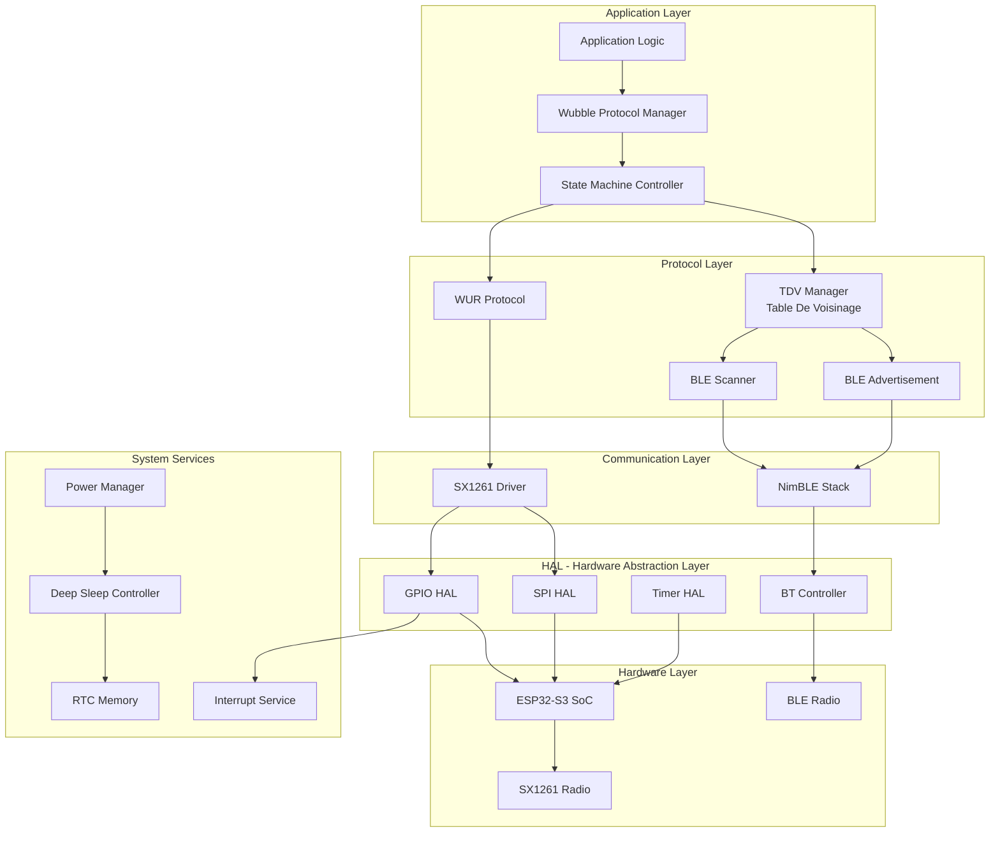

---

## 3. Block Diagrams

### 3.1 Hardware Block Diagram

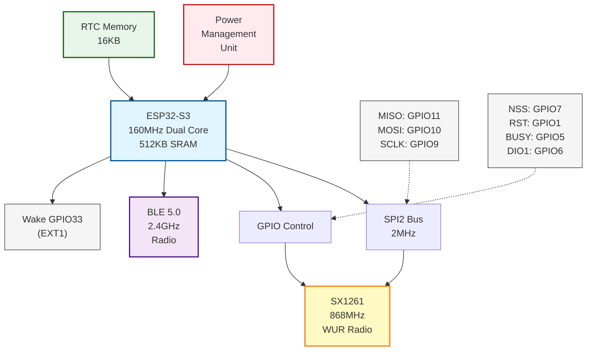

### 3.2 Software Component Diagram

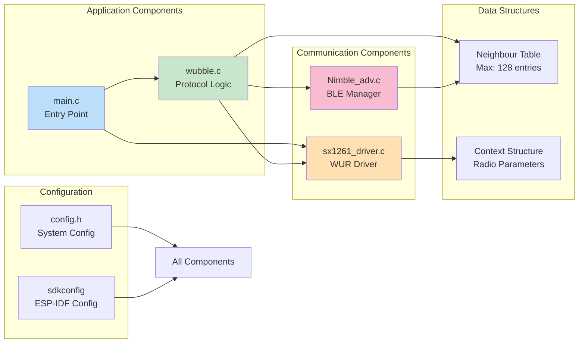

---

## 4. Sequence Diagrams

### 4.1 System Initialization Sequence

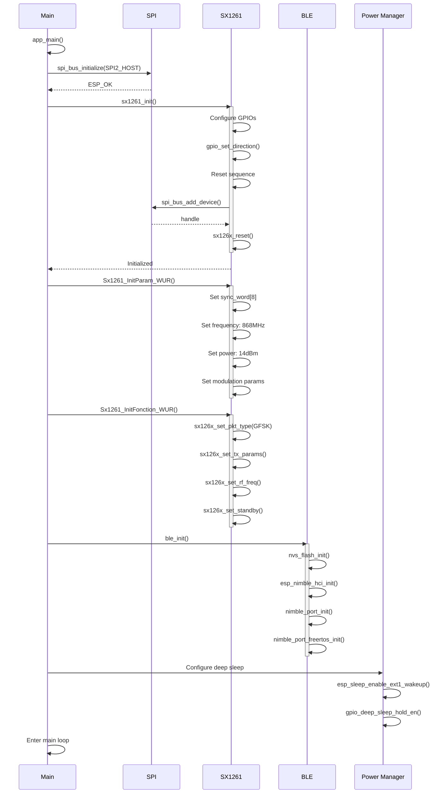

### 4.2 Wake-up Radio (WUR) Communication Sequence

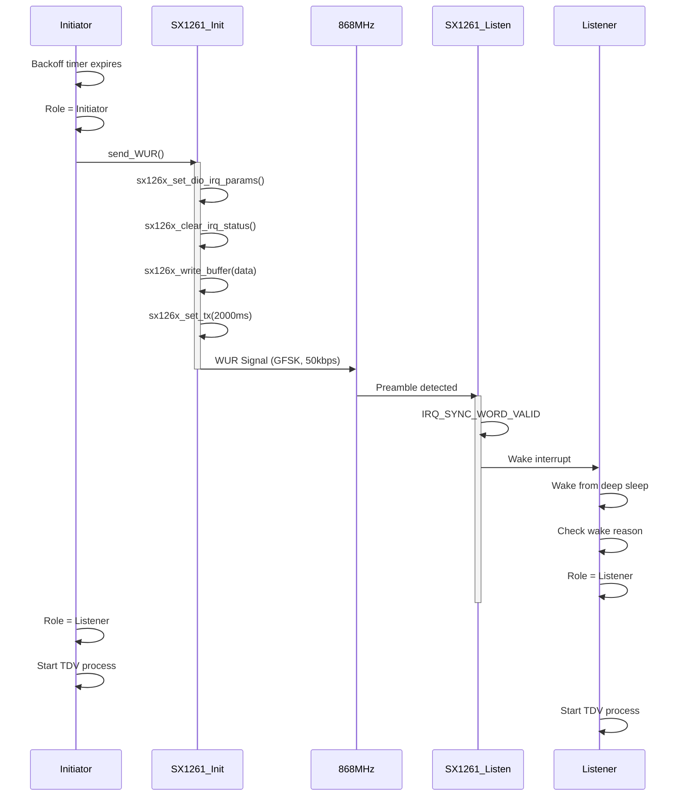

### 4.3 BLE Neighbor Discovery (TDV) Sequence

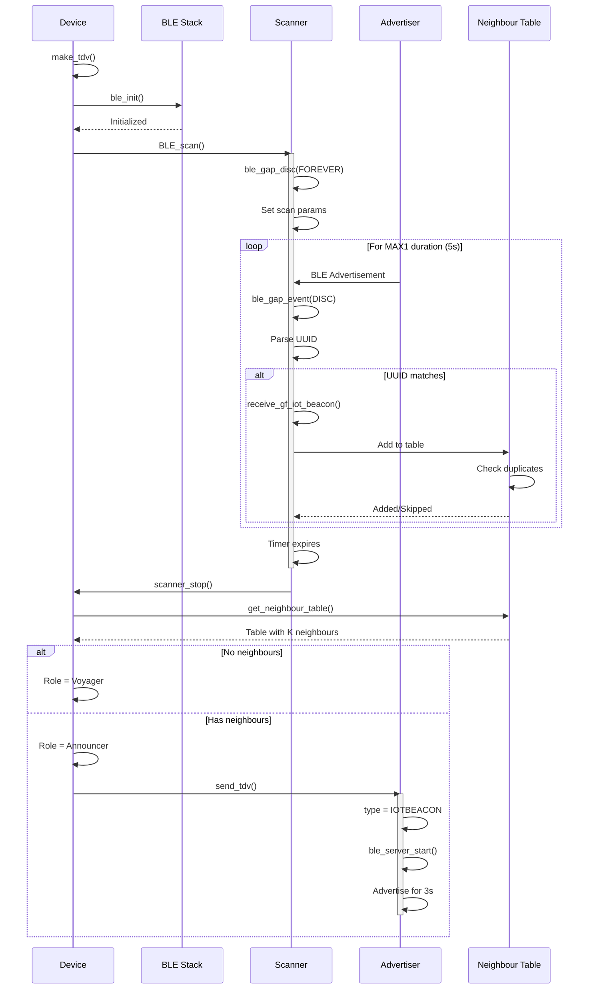

### 4.4 Deep Sleep and Wake-up Sequence

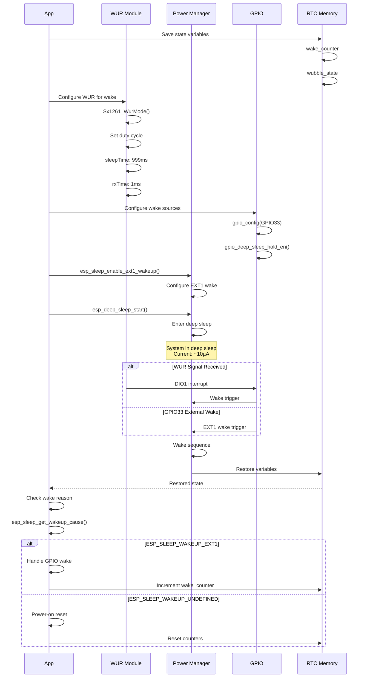

---

## 5. Flowcharts

### 5.1 Main Application Flow

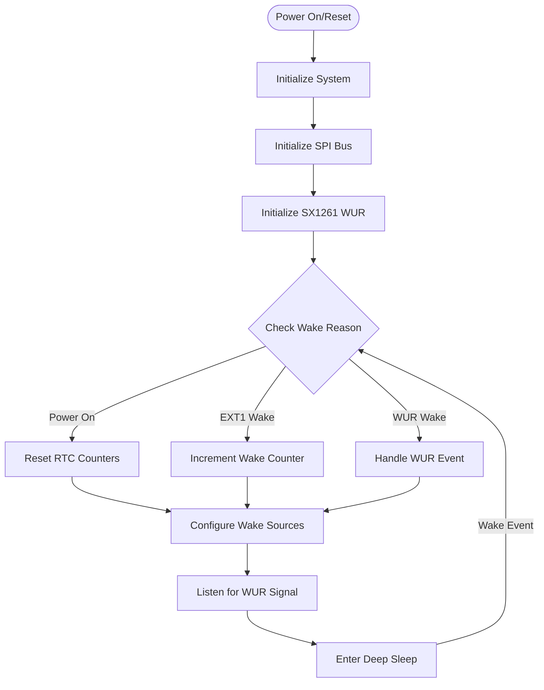

### 5.2 Wubble Protocol State Machine Flow

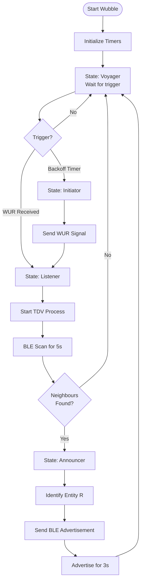

### 5.3 BLE Scanning Flow

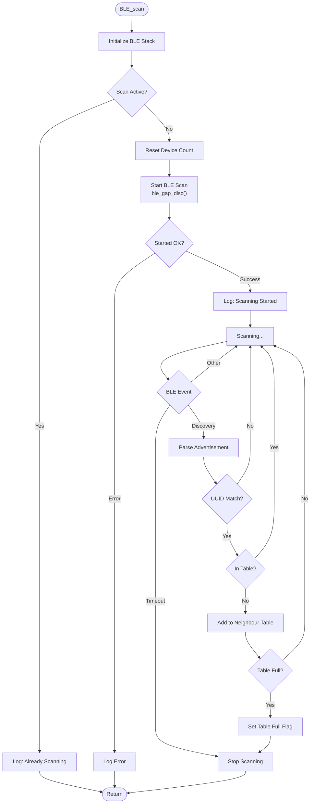

### 5.4 WUR Reception Flow

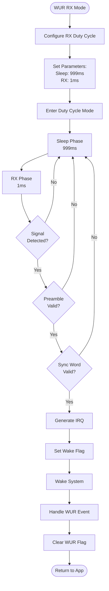

---

## 6. Component Details

### 6.1 Main Component (main.c)

```markdown
**Purpose**: Application entry point and deep sleep management

**Key Functions**:
- `app_main()`: Initialize system and enter deep sleep loop
- Wake source configuration (GPIO33 as EXT1)
- RTC memory management for state persistence

**RTC Variables**:
- `wake_counter`: Number of wake-ups since power-on
- `wubble_state`: Current protocol state (0-3)
```

### 6.2 Wubble Component

```markdown
**File**: components/wubble/wubble.c

**Purpose**: Wubble protocol state machine implementation

**Key Functions**:
- `wubble()`: Main protocol loop
- `make_tdv()`: Create neighbor table via BLE scanning
- `send_tdv()`: Broadcast neighbor information
- `timer_callback()`: Handle protocol timers

**States**:
- 0: Listener - Waiting for commands
- 1: Initiator - Sending WUR signals
- 2: Announcer - Broadcasting neighbor info
- 3: Voyager - Idle/waiting state

**Timers**:
- Backoff Timer: Random delay (0-10s)
- Timer-L1: TDV scan duration (5s)
- Timer-L2: Maximum wait time (4s)
```

### 6.3 SX1261 Driver Component

```markdown
**File**: components/wubble/sx1261_driver.c

**Purpose**: Low-level driver for SX1261 WUR transceiver

**Key Functions**:
- `sx1261_init()`: Initialize radio hardware
- `Sx1261_InitParam_WUR()`: Configure WUR parameters
- `Sx1261_WurMode()`: Set duty-cycled receive mode
- `Sx1261_Send_WuR_Signal()`: Transmit wake-up beacon
- `Listen_WUR()`: Listen for incoming WUR signals

**Configuration**:
- Frequency: 868 MHz
- Modulation: GFSK
- Bit Rate: 50 kbps
- Bandwidth: 312 kHz
- Power: +14 dBm
- Preamble: 50000 bits
- Sync Word: 8 bytes (0x7E pattern)
```

### 6.4 NimBLE Advertisement Component

```markdown
**File**: components/Nimble_adv/Nimble_adv.c

**Purpose**: BLE advertisement and scanning management

**Key Functions**:
- `ble_init()`: Initialize NimBLE stack
- `BLE_scan()`: Start neighbor discovery scan
- `send_tdv()`: Send BLE advertisement
- `receive_gf_iot_beacon()`: Process received beacons
- `get_neighbour_table()`: Retrieve discovered neighbors

**BLE Configuration**:
- Stack: NimBLE
- Mode: Observer + Broadcaster
- UUID: 0x850c7d3c-d435-4662-a61f-25627693ddac
- Advertisement Types:
  - IBEACON: Standard iBeacon
  - IOTBEACON: Custom IoT beacon
  - APPBEACON: Application beacon

**Neighbor Table**:
- Maximum entries: 128
- Entry format: [ID(4 bytes) + States(1 byte)]
```

---

## 7. Configuration

### 7.1 Hardware Pin Configuration (config.h)

```c
// SPI Configuration
#define PIN_SPI_SCLK    9
#define PIN_SPI_MOSI    10
#define PIN_SPI_MISO    11
#define USED_SPI_HOST   SPI2_HOST

// SX1261 WUR Pins
#define CONFIG_NSS_GPIO   7   // Chip Select
#define CONFIG_RST_GPIO   1   // Reset
#define CONFIG_BUSY_GPIO  5   // Busy indicator
#define CONFIG_DIO1_GPIO  6   // Digital IO 1

// Wake-up Configuration
#define WAKEUP_GPIO      GPIO_NUM_33  // EXT1 wake source
```

### 7.2 WUR Parameters (config.h)

```c
// WUR Timing
#define DEEP_SLEEP_SLEEP_PERIOD_MS  999
#define DEEP_SLEEP_RX_PERIOD_MS      1
#define TX_TIME_MS                   2000

// WUR Radio Configuration
#define SYNCWORD_LENGTH              8
#define PREAMBLE_LENGTH_IN_BIT       50000
#define BR_IN_BPS                    50000   // Bit rate
#define FDEV_IN_HZ                   23848   // Frequency deviation
#define BW_DSB_PARAM                 SX126X_GFSK_BW_312000
#define POWER                        14      // +14 dBm
```

### 7.3 BLE Configuration (config.h)

```c
// BLE Parameters
#define ID_BLE_SIZE                     4
#define MAX_IOT_IDS_IN_NEIGHBOUR_TABLE  128
#define ID_IOT                          {0x66, 0x66, 0x66, 0x66}

// Timing
#define BLE_SCAN_ADV_MAX_DURATION_S     2
#define ADV_DURATION_DSCV_S             4

// UUID
#define GF_BEACON_UUID  {0x85, 0x0c, 0x7d, 0x3c, 0xd4, 0x35, \
                        0x46, 0x62, 0xa6, 0x1f, 0x25, 0x62, \
                        0x76, 0x93, 0xdd, 0xac}
```

### 7.4 Wubble Protocol Timers (config.h)

```c
// Wubble Timers
#define K      10        // Neighbor threshold
#define MAX    10000000  // Max backoff (10s in µs)
#define MAX1   5000000   // TDV scan duration (5s in µs)
#define MAX2   5000000   // Max wait time (5s in µs)
```

---

## 8. API Reference

### 8.1 Wubble Protocol API

```c
// Main protocol function
void wubble(void);

// TDV Management
void make_tdv(void);
void send_tdv(void);
neighbour_table_t get_neighbour_table(void);

// Timer callback
void timer_callback(int arg);
```

### 8.2 SX1261 WUR API

```c
// Initialization
void sx1261_init(void);
void Sx1261_InitParam_WUR(context_t *context);
void Sx1261_InitFonction_WUR(context_t *context);

// WUR Operations
void send_WUR(void);
void Listen_WUR(void);
void Sx1261_WurMode(context_t *context, uint32_t sleepTime, uint32_t rxTime);
void Sx1261_Send_WuR_Signal(context_t *context, uint8_t* data, uint8_t length);
void Sx1261_RstWurFlag(context_t *context);

// Low-level SX126x functions
sx126x_status_t sx126x_set_sleep(const void* context, const sx126x_sleep_cfgs_t cfg);
sx126x_status_t sx126x_set_standby(const void* context, const sx126x_standby_cfg_t cfg);
sx126x_status_t sx126x_set_rx_duty_cycle(const void* context, 
                                         const uint32_t rx_time_in_ms,
                                         const uint32_t sleep_time_in_ms);
```

### 8.3 BLE API

```c
// Initialization
void ble_init(void);

// Server Operations
void ble_server_start(void);
void ble_server_stop(void);

// Scanning
void BLE_scan(void);
void scanner_stop(void);

// Advertisement
void send_BLE_ID(void);

// Neighbor Management
void receive_gf_iot_beacon(uint8_t* gf_beacon);
bool is_iot_id_in_ble_table(size_t table_size, uint8_t* value);
void print_ble_table(void);
```

### 8.4 Data Structures

```c
// Neighbor entry
typedef struct {
    uint8_t neighbour[4];      // Device ID
    uint8_t states_neighbour;  // Device state
} neighbour_t;

// Neighbor table
typedef struct {
    size_t size;
    neighbour_t neighbours[MAX_NEIGHBOURS];
} neighbour_table_t;

// Radio context
typedef struct context_s {
    uint32_t frequency;
    uint8_t power;
    uint8_t sync_word[8];
    sx126x_mod_params_gfsk_t mode_parameters;
    sx126x_pkt_params_gfsk_t pkt_parameters;
} context_t;

// BLE beacon structures
typedef struct {
    adv_head_t adv_head;
    esp_ble_uuid_t uuid;
    uint8_t iot_id[ID_BLE_SIZE];
    uint8_t both_states;
    uint8_t relevance;
    uint8_t x;
} __attribute__((packed)) goodfloow_iot_beacon_t;
```

---

## 9. State Machine

### 9.1 State Transitions

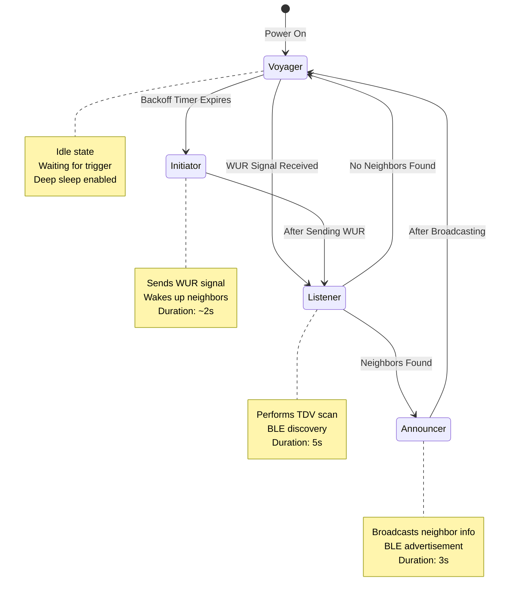

To be continued